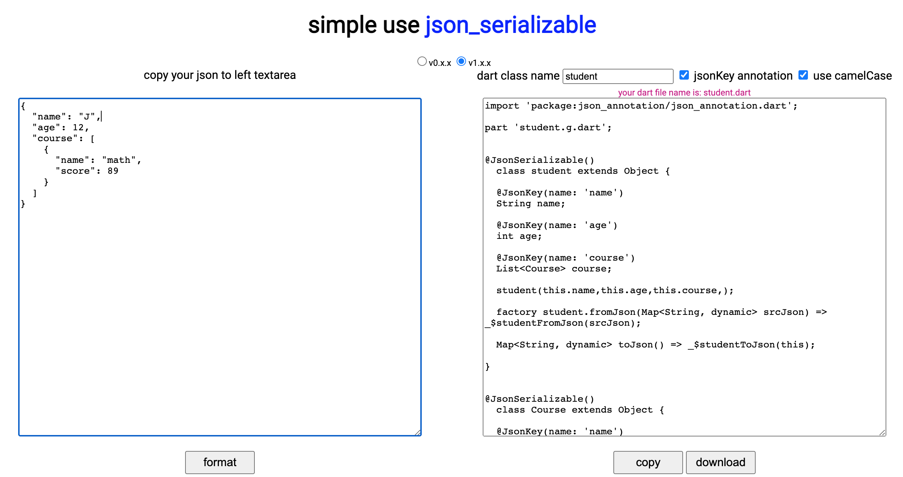

## Flutter json2dart数据解析

## 使用@JsonSerializable()、@JsonKey()辅助序列化

pubspec.yaml
```yaml
environment:
  sdk: ">=2.12.0 <3.0.0"

dependencies:
  json_annotation: ^3.0.0

dev_dependencies:
  flutter_test:
    sdk: flutter
  build_runner: ^1.9.0
  json_serializable: ^3.0.0
```

访问: <https://caijinglong.github.io/json2dart/index_ch.html/>

1. 将json数据填入右边，左边生成dart代码，选择类名，驼峰风格。点击下载

2. 将dart文件放项目中，在终端执行
```shell
  flutter packages pub run build_runner build --delete-conflicting-outputs
```

### 例子
```json```
```json
{
  "name": "J",
  "age": 12,
  "course": [
    {
      "name": "math",
      "score": 89
    }
  ]
}
```
转化```.dart```
```dart
import 'package:json_annotation/json_annotation.dart'; 
  
part 'student.g.dart';


@JsonSerializable()
  class student extends Object {

  @JsonKey(name: 'name')
  String name;

  @JsonKey(name: 'age')
  int age;

  @JsonKey(name: 'course')
  List<Course> course;

  student(this.name,this.age,this.course,);

  factory student.fromJson(Map<String, dynamic> srcJson) => _$studentFromJson(srcJson);

  Map<String, dynamic> toJson() => _$studentToJson(this);

}

  
@JsonSerializable()
  class Course extends Object {

  @JsonKey(name: 'name')
  String name;

  @JsonKey(name: 'score')
  int score;

  Course(this.name,this.score,);

  factory Course.fromJson(Map<String, dynamic> srcJson) => _$CourseFromJson(srcJson);

  Map<String, dynamic> toJson() => _$CourseToJson(this);

}
```

执行
```shell
  flutter packages pub run build_runner build --delete-conflicting-outputs
```

生成```.g.dart```文件